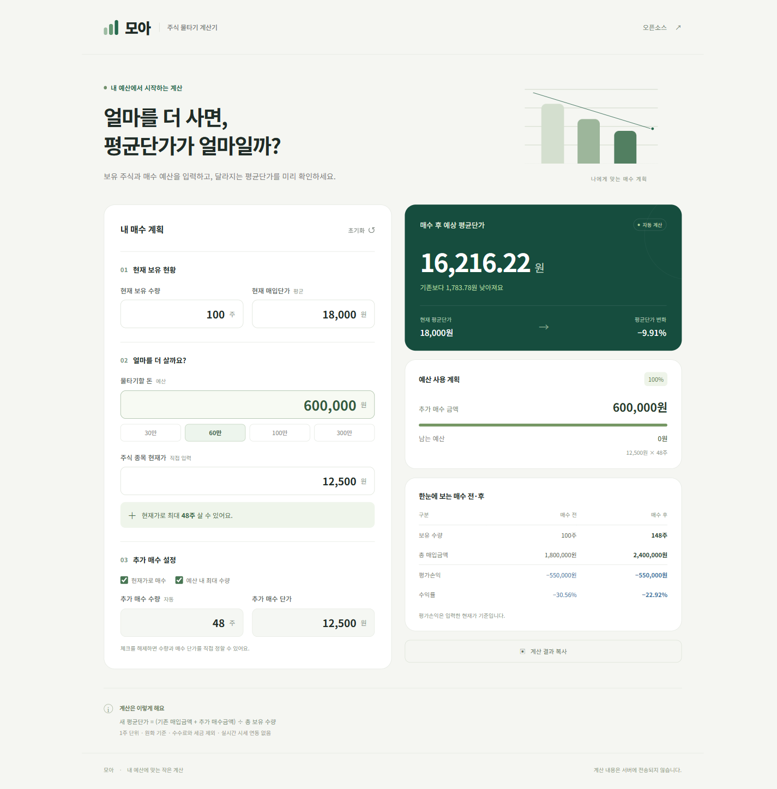

# 모아 · 예산 맞춤 주식 물타기 계산기

**내 예산으로 몇 주를 더 살 수 있을까? 매수 후 평균단가는 얼마일까?**

현재 보유 수량, 평균 매입단가, 추가 매수 예산과 현재가를 입력하면 매수 가능 수량과 새 평균단가를 즉시 계산하는 한국어 웹 계산기입니다. 별도 설치나 회원가입 없이 로컬에서 사용할 수 있습니다.



## 바로 실행하기

1. 이 저장소를 내려받습니다. GitHub의 **Code → Download ZIP**을 선택해 압축을 풀거나 아래 명령을 사용합니다.
2. 폴더 안의 **`index.html`을 더블클릭**합니다.
3. 원하는 값을 입력하면 결과가 자동으로 바뀝니다.

```sh
git clone https://github.com/marthos1/stock-average-calculator.git
```

최신 Chrome, Edge, Firefox, Safari에서 사용할 수 있습니다. 실행에 Node.js나 개발 서버는 필요하지 않습니다. 인터넷이 끊겨도 계산할 수 있습니다.

## 입력 항목

| 항목               | 설명                                                                    |
| ------------------ | ----------------------------------------------------------------------- |
| 현재 보유 수량     | 이미 보유한 주식 수량. 0주부터 입력할 수 있습니다.                      |
| 현재 매입단가      | 기존 주식의 1주당 평균 매입단가입니다.                                  |
| 물타기할 돈 (예산) | 추가 매수에 사용할 총금액입니다. 기본 예시는 600,000원입니다.           |
| 주식 종목 현재가   | 직접 확인한 1주당 현재 가격입니다.                                      |
| 추가 매수 수량     | 기본적으로 예산 안에서 살 수 있는 최대 정수 수량을 자동 계산합니다.     |
| 추가 매수 단가     | 기본적으로 현재가를 사용하며, 다른 매수 예정 가격으로 바꿀 수 있습니다. |

**현재가로 매수**를 해제하면 추가 매수 단가를, **예산 내 최대 수량**을 해제하면 추가 매수 수량을 직접 입력할 수 있습니다. 수량을 직접 지정해 예산을 넘기면 초과 금액과 예산 내 최대 수량을 알려줍니다. 예산 초과 계획도 비교할 수 있도록 계산 결과는 유지됩니다.

현재가 아래의 **“현재가로 최대 ○주”**는 현재가 기준입니다. 별도 매수 단가를 정했다면 자동으로 채워지는 **추가 매수 수량**은 그 매수 단가를 기준으로 계산됩니다.

## 확인할 수 있는 결과

- 추가 매수 후 평균단가와 기존 대비 변화 금액·비율
- 추가 매수금액, 예산 사용률, 남는 예산 또는 초과 금액
- 매수 전후 총 보유 수량과 총 매입금액
- 입력한 현재가 기준 평가손익과 수익률
- 결과 복사, 예산 빠른 선택, 기본 예시로 초기화
- 휴대폰과 PC 화면에 맞춘 반응형 레이아웃

## 60만 원 계산 예시

현재 **100주**를 평균 **18,000원**에 보유하고 있고 현재가가 **12,500원**이라면:

| 계산                 |                    결과 |
| -------------------- | ----------------------: |
| 예산                 |               600,000원 |
| 추가 매수 가능 수량  |                    48주 |
| 추가 매수금액        |               600,000원 |
| 남는 예산            |                     0원 |
| 매수 후 총 보유 수량 |                   148주 |
| 매수 후 총 매입금액  |             2,400,000원 |
| 매수 후 평균단가     |          약 16,216.22원 |
| 평균단가 변화        | 약 −1,783.78원 (−9.91%) |

현재가 12,500원에 그대로 매수하는 예시에서는 평가손익 금액이 매수 전후 **−550,000원으로 같습니다.** 평균단가와 손실률이 낮아져도 기존 평가손실 금액 자체가 사라지는 것은 아닙니다.

## 계산식과 기준

```text
매수 가능 수량 = floor(예산 ÷ 추가 매수 단가)
기존 매입금액 = 현재 보유 수량 × 현재 매입단가
추가 매수금액 = 추가 매수 수량 × 추가 매수 단가
남는 예산 = 예산 − 추가 매수금액
총 보유 수량 = 현재 보유 수량 + 추가 매수 수량
새 평균단가 = (기존 매입금액 + 추가 매수금액) ÷ 총 보유 수량
평가손익 = (총 보유 수량 × 현재가) − 총 매입금액
수익률 (%) = 평가손익 ÷ 총 매입금액 × 100
```

- 원화, **1주 단위 정수 수량**, 금액은 **소수 둘째 자리**까지 지원합니다.
- 금액을 0.01원 단위의 `BigInt` 정수로 바꿔 예산 나눗셈과 매입금액을 계산합니다. `0.30 ÷ 0.10` 같은 경계에서도 매수 수량이 잘못 줄어들지 않습니다.
- 평균단가와 비율은 화면에서 소수 둘째 자리까지 반올림합니다. 표시값을 다음 계산에 재사용하지 않습니다.
- 입력 금액은 각각 100억 원, 입력 및 자동 산출 매수 수량은 각각 1억 주까지 지원합니다. 총 매입금액이나 평가금액이 안전한 정수 계산 범위를 초과하면 오류를 표시합니다.
- 현재가와 추가 매수 단가는 0원보다 커야 합니다. 기존 보유 수량이 0주라면 기존 매입단가는 0원으로 입력할 수 있습니다.
- 보유 수량이나 매입금액이 없어 계산할 수 없는 평균단가·수익률은 `—`로 표시합니다.
- **수수료, 세금, 호가 단위, 주문 체결 여부는 반영하지 않습니다.** 시세는 자동 조회하지 않습니다.

## 개인정보 및 저장

입력값은 브라우저 안에서만 계산합니다. 서버, 외부 API, 분석 도구, 외부 폰트/CDN을 사용하지 않습니다. 입력 내용은 저장하지 않으며 새로고침하면 기본 예시로 돌아갑니다. **계산 결과 복사**를 누를 때만 결과를 클립보드로 복사합니다. 브라우저 권한에 따라 복사가 제한될 수 있습니다.

## 개발 및 검증

HTML, CSS, 순수 JavaScript로 구성했으며 런타임 의존성과 빌드 과정이 없습니다.

```text
index.html                  화면과 입력 폼
styles.css                  반응형 스타일
calculator.js               독립적인 계산·검증 함수
app.js                      입력 연동, 결과 표시, 복사
assets/favicon.svg          아이콘
tests/calculator.test.cjs   계산 검증
.github/workflows/test.yml  GitHub Actions 자동 테스트
```

Node.js 20 이상에서 패키지 설치 없이 테스트할 수 있습니다.

```sh
npm test
```

테스트는 60만 원 예시, 나머지 예산, 소수 금액의 경계, 단가 변경, 예산 초과, 0원·0주, 잘못된 입력, 큰 금액의 한도 등을 확인합니다. GitHub에 push하거나 pull request를 열 때도 같은 테스트가 실행됩니다.

## 기여하기

오류 제보와 개선 제안은 [Issues](https://github.com/marthos1/stock-average-calculator/issues)에 남겨 주세요. 코드를 수정했다면 `npm test`를 실행하고, `index.html`을 열어 변경한 동작과 모바일 화면을 확인한 후 pull request를 보내 주세요.

## 라이선스

[MIT License](LICENSE). 출처와 라이선스 고지를 유지하면서 자유롭게 사용, 수정, 배포할 수 있습니다.
